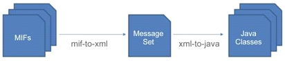
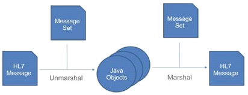

## Solution for API integration

Infoway Message Builder allows developers to focus on the business challenges of integrating their solutions with each electronic health record implementation by abstracting the differences between different versions of pan-Canadian HL7 messaging and supporting current implementation constraints. Developers can build interfaces in a familiar development environment, using the programming language of their choice*, while the Message Builder API fosters quick and easy creation, population and access to HL7v3 requests and responses.

Infoway Message Builder v2.0 and later is enhanced to generate JAVA APIs to create, validate, marshal/unmarshal CDA documents.

## Key features and benefits

Message Builder offers a number of key features and benefits:

1. Abstracts the complexity of HL7v3 messages and greatly simplifies the work of the developer when implementing them;
2. Reduces the impact on developers from implementation variations;
3. Enables companies to achieve Infoway product certification with greater confidence and reduced time;
4. Enables developers to incorporate future message versions without re-writing their products;
5. Can be embedded in software applications due to its open source distribution under a commercial-friendly Apache 2.0 license.

### Out of the box support

Infoway Message Builder comes with built-in runtime APIs that support a number of pan-Canadian specifications:

- MR2009 (R02.04.02)
- MR2007 (V02R02)
- MR 2007 (V02R01)
- CeRx (V01R04.3)

In addition, while developers can easily build custom transport mechanisms without affecting the core, Message Builder includes native support for SOAP and RESTful message transports. Developers can configure and extend the transport as desired.

### Detailed product features

- Provides the capability to configure and populate message values that are common to all messages—this allows developers to reuse common message data, shortening the time to configure and create an interoperable system.
- Uses simplified data types that are natural and familiar to the programming language (e.g. String for ST) rather than directly exposing the sometimes complicated HL7v3 data types—yet still allowing access to HL7v3 data types when necessary.
- Allows developers to focus on the business-aspect of a request/response, avoiding many of the complexities of HL7v3.
- Code-generation algorithms merge identical and similar classes together to simplify the generated API—meaning less confusion in the resulting code and an increased ability to write generic handlers for certain types.
- Converts populated objects into HL7v3 XML requests, and converts HL7v3 responses into populated objects.
- Provides flexibility in configuring and performing terminology-code lookups, including code set and database-backed lookups (can mix and match).
- Associations and attributes are strongly typed, given business names when provided, and contain code docs directly from the MIFs (see [wiki.hl7.org/index.php?title=MIF](wiki.hl7.org/index.php?title=MIF)).
- The algorithms inline most classes that only have a small number of properties, further simplifying the API.
- Offers both permissive and strict modes—permissive allows many common errors and generates appropriate error comments in the XML or result object.
- A separate validation tool is provided to test ad-hoc messages—this tool reuses the same validation components that are executed during message marshaling and unmarshalling, ensuring consistent processing of the message whether during processing or during conformance validation.

#### Forward looking

The power of the Message Builder architecture is in its MIF-based generation of the specification API. With Message Builder, any MIF is supported—whether a future release of the pan-Canadian specifications or a modified (constrained) jurisdiction-specific release of an existing specification. 

###  How it works

Message Builder comprises two parts:

1. Message Builder Generator—a tool used by Infoway to take input MIFs and create Message Sets for use by Message Builder Runtime;
2. Message Builder Runtime—an API used by developers to allow their products to support multiple Message Sets without recoding.

#### Message Builder Generator

Used by Infoway, Message Builder Generator takes MIFs (as the source of truth for standards specifications) and converts them into a series of Java Classes. This is done by first converting the MIFs to an XML Message Set (a simplified representation of the information present in the original MIFs), then generating Java Classes that reference standard Java data types and use business-friendly names. In the process, groups of related elements are flattened and similar message parts are placed into a single class: these steps increase ease of use and reduce the complexity of the resulting Java Classes.

Using Message Builder Generator, Infoway is able to create multiple Message Sets, each representing the MIFs used in a single jurisdiction, but all for the same HL7v3 version.

#### Message Builder Runtime

Message Builder Runtime allows developers to quickly adapt to implementations in multiple Jurisdictions: incoming messages are first examined to determine the corresponding source Message Set, once identified, a series of Java Objects that represent the message are instantiated. Next, the Java Objects are turned into an HL7 message for the HL7 version corresponding to the desired destination Message Set. 

Using Message Builder Runtime developers can accept messages over the wire and on-the-fly turn them into a different HL7 message version. Given the capability of Message Builder to support future versions of HL7 messages, developers can easily future proof their products with minimal effort.

#### *Developer friendly

The Message Builder libraries are available for Java and Microsoft .NET. In addition, a simplified XML message format is available with REST-based services for managing mapping to/from the simplified form to the target specification XML format.

### CDA Support

Message Builder CDA API supports the following CDA and data type specifications:

- CCDA specification R1.1 ([www.hl7.org/implement/standards/product_brief.cfm?product_id=258](www.hl7.org/implement/standards/product_brief.cfm?product_id=258))
- Pan Canadian CDA header guideline;
- CDA R2 data types;
- Pan Canadian data types  (MR 2.05).

Message Builder provides  JAVA and .NET APIs for CDA document creation, validation, marshalling/unmarshalling of the following CDA document types:

- Continuity of Care Document (CCD) (Release 1.1)
- Consultation Notes (Release 1.1)
- Discharge Summary (Release 1.1)
- Imaging Integration, and DICOM Diagnostic Imaging Reports (DIR) (Release 1)
- History and Physical (H&P) (Release 1.1)
- Operative Note (Release 1.1)
- Progress Note (Release 1.1)
- Procedure Note (Release 1)
- Unstructured Documents (Release 1.1)
- CDA documents using pan Canadian CDA header template

Clinical applications in JAVA or .NET can use the Message Builder CDA APIs to create, validate or parse above listed types of CDA documents. Potential use cases are document source or document consumer actors in IHE XDS profile, content creator/content consumer in any content module/profile, or report creator/viewer in RIS/PACS/EMR systems.
